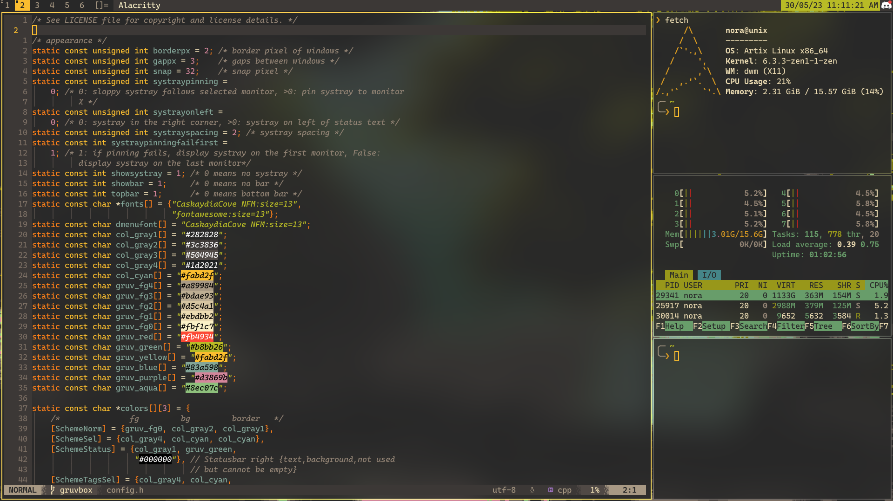

# DWM config

## Screenshot

What is in the image:
* [Neovim](https://github.com/neovim/neovim) (config at [this repo](https://github.com/redpz/nvim))
* [Fastfetch](https://github.com/LinusDierheimer/fastfetch)
* [Alacritty](https://github.com/alacritty/alacritty)

Font for anyone wondering this [CaskaydiaCove NFM](https://www.nerdfonts.com/font-downloads)
